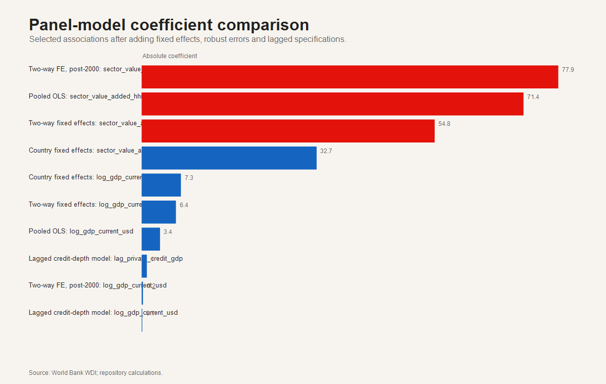
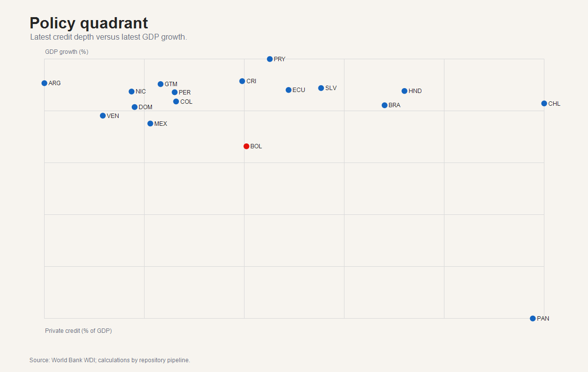

# Financial Development, Stability and Growth in Latin America

**Reproducible evidence on financial development, political instability and economic growth across Latin America**


[](https://monicact.github.io/latin-america-financial-development-lab/)
[](https://github.com/MonicaCT/latin-america-financial-development-lab/blob/main/dashboard/index.html)
[](https://github.com/MonicaCT/latin-america-financial-development-lab/blob/main/report/financial_development_report.html)
[](https://github.com/MonicaCT/latin-america-financial-development-lab/blob/main/report/executive_report.html)
[](https://github.com/MonicaCT/latin-america-financial-development-lab)
[](https://monicact.github.io/)

Repository: [latin-america-financial-development-lab](https://github.com/MonicaCT/latin-america-financial-development-lab)

## Research question

How do financial development, macroeconomic stability and productive structure differ across Latin America, and what do these differences imply for regional comparison, growth diagnostics and Bolivia-centered policy interpretation?

This repository is a public-data research compendium on financial development in Latin America. It reconstructs the original project after the historical monthly regulator panels were found absent from Git history, then upgrades the analysis to a doctoral-portfolio standard: transparent measurement, distributional diagnostics, PCA, clustering, composite-index sensitivity, robust panel models, a policy dashboard and a working-paper report.

## Why this matters

Financial development can support growth and productive transformation, but aggregate credit depth can also hide unequal allocation, macro-financial volatility and institutional fragility. This project makes those measurement choices visible. It uses official public data to compare countries, document uncertainty, separate reconstructed annual equivalents from unavailable legacy regulator panels, and present macro-financial evidence in a reproducible dashboard and working paper.

## Key findings

- The reconstructed panel contains 1,122 country-year observations for 17 Latin American countries.
- The project uses official World Bank WDI indicators rather than fabricating missing monthly regulator panels.
- The region separates into shallow, intermediate and deep financial-system profiles.
- Composite rankings are informative, but some results are sensitive to index weights.
- Bolivia is visible in the regional benchmark, while stronger sectoral claims require renewed regulator-level reconstruction.
- Panel-model outputs are diagnostic associations, not final causal evidence about credit allocation or growth.

## Portfolio classification

| Dimension | Classification |
|---|---|
| Primary Lab | Applied Economics Lab |
| Secondary Labs | Research Methods Lab; Development Analytics Lab; Business Intelligence Lab; Open Science Lab |
| Research domain | Financial development, macro-financial stability, economic growth and regional comparison in Latin America |
| Research question | How do financial depth, macroeconomic stability and productive structure differ across Latin American countries? |
| Methods | Public-data reconstruction, distributional analysis, PCA, clustering, composite-index sensitivity, fixed-effects models and dashboard reporting |
| Tools | R, Quarto, Shiny dashboard, PowerShell, GitHub Pages, HTML reports and reproducible scripts |
| Scientific status | Advanced research project; working paper; dashboard project; reproducible analytical pipeline |
| Portfolio role | Demonstrates macro-financial panel analysis, growth modelling, regional comparison, reproducible reporting and policy-oriented interpretation for Latin America. |

## Main figures

| Composite index | PCA clusters |
|---|---|
|  |  |

| Rank sensitivity | Bolivia benchmark |
|---|---|
|  |  |

| Model coefficients | Policy quadrant |
|---|---|
|  |  |

## Data and coverage

The project uses a reconstructed annual public-data panel:

- 1,122 country-year observations;
- 17 Latin American countries;
- official World Bank WDI indicators;
- reconstructed annual equivalents for legacy `CreditType`, `EconomicSector` and `PanelCompleto` data products.

Main public files:

- [PanelCompleto.reconstructed.csv](data/processed/PanelCompleto.reconstructed.csv)
- [financial_development_panel.csv](data/processed/financial_development_panel.csv)
- [variable dictionary](docs/VARIABLE_DICTIONARY.md)
- [data reconstruction log](docs/DATA_RECONSTRUCTION_LOG.md)
- [data recovery audit](docs/DATA_RECOVERY_AUDIT.md)

## Methodology

The analysis reconstructs a comparable public-data panel, validates coverage, computes financial-development indicators, estimates country profiles, builds composite indices, applies PCA and clustering, and reports panel-model diagnostics. The workflow explicitly records when original legacy disaggregations are unavailable.

Detailed documentation: [methodology](docs/METHODOLOGY.md), [methodological review](docs/METHODOLOGICAL_REVIEW.md), [replication guide](docs/REPLICATION_GUIDE.md) and [quality-control report](docs/QUALITY_CONTROL_REPORT.md).

## Econometric evidence

The repository includes pooled and fixed-effects panel-model outputs, robustness tables and model diagnostics. These results are read as macro-financial associations and diagnostic evidence, not as final causal estimates. The working paper and methodology notes document this boundary.

## Paper and reports

- [Working paper HTML](report/financial_development_report.html)
- [Working paper PDF](report/financial_development_report.pdf)
- [Executive report HTML](report/executive_report.html)
- [Executive report PDF](report/executive_report.pdf)
- [Doctoral committee evaluation](docs/DOCTORAL_COMMITTEE_EVALUATION.md)
- [Project links](docs/PROJECT_LINKS.md)

## Dashboard

The dashboard is available as a public repository HTML file: [dashboard/index.html](https://github.com/MonicaCT/latin-america-financial-development-lab/blob/main/dashboard/index.html).

It is also stored as [dashboard/index.html](dashboard/index.html), with source in [dashboard/app.R](dashboard/app.R). It should be interpreted as a macro-financial reporting dashboard, not as a new empirical result beyond the documented pipeline.

## Repository structure

```text
dashboard/        Shiny dashboard source and rendered dashboard
report/           Working paper and executive report in HTML/PDF/QMD formats
docs/             Methodology, audits, replication guide and portfolio documentation
data/processed/   Reconstructed public-data panels
data/metadata/    Source and validation metadata
outputs/figures/  Publication figures and dashboard figures
outputs/tables/   Tables, model diagnostics and exported reporting assets
outputs/models/   Model summaries and regression outputs
replication/      Reproduction entry point and session information
src/              R and PowerShell workflow scripts
```

## Reproducibility

Use the replication guide and public reconstruction scripts:

```powershell
powershell.exe -NoProfile -ExecutionPolicy Bypass -File .\src\reconstruct_public_data.ps1 -Root (Resolve-Path .).Path
powershell.exe -NoProfile -ExecutionPolicy Bypass -File .\src\final_quality_upgrade.ps1 -Root (Resolve-Path .).Path
```

The current phase did not rerun these scripts. Reproduction instructions are documented in [replication/README.md](replication/README.md) and [docs/REPLICATION_GUIDE.md](docs/REPLICATION_GUIDE.md).

## Limitations

The reconstructed annual WDI panel is internationally comparable and reproducible, but it is not the exact missing monthly regulator panel. `CreditType.reconstructed` and `EconomicSector.reconstructed` are official annual equivalents, not recovered historical disaggregations. Results should be read as macro-financial diagnostics and portfolio evidence, not as final causal evidence about sectoral credit allocation or growth.

## Citation

Use [CITATION.cff](CITATION.cff) for machine-readable citation metadata. No DOI is currently listed for this repository.

## Author

[Monica Cueto Tapia](https://github.com/MonicaCT)

Applied Economist | Research Scientist | Development Analytics | Public Policy | Business Intelligence | Data Science | Open Science

## Portfolio navigation

[Back to Monica Cueto Tapia's research portfolio](https://github.com/MonicaCT)

**Primary Lab:** Applied Economics Lab

**Secondary Labs:** Research Methods Lab, Development Analytics Lab, Business Intelligence Lab, Open Science Lab

**Related projects:**

- [economic-complexity-structural-transformation-lac](https://github.com/MonicaCT/economic-complexity-structural-transformation-lac)
- [InclusiveCreditRiskAnalytics-Bolivia](https://github.com/MonicaCT/InclusiveCreditRiskAnalytics-Bolivia)
- [poverty-informality-social-protection-lac](https://github.com/MonicaCT/poverty-informality-social-protection-lac)
- [structural-vulnerability-lac-research](https://github.com/MonicaCT/structural-vulnerability-lac-research)
