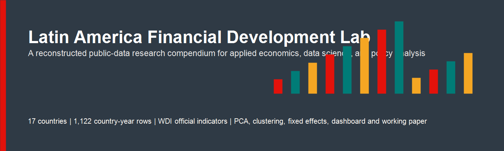
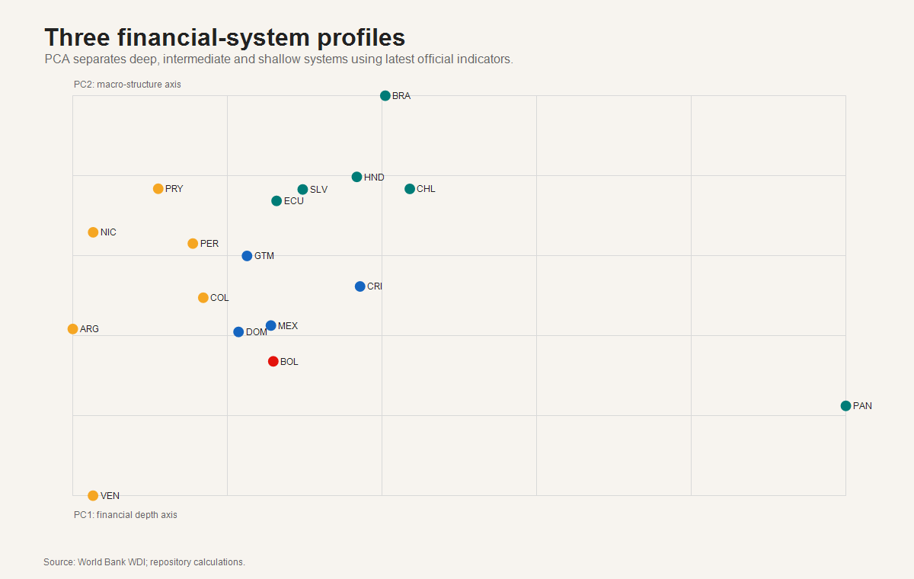
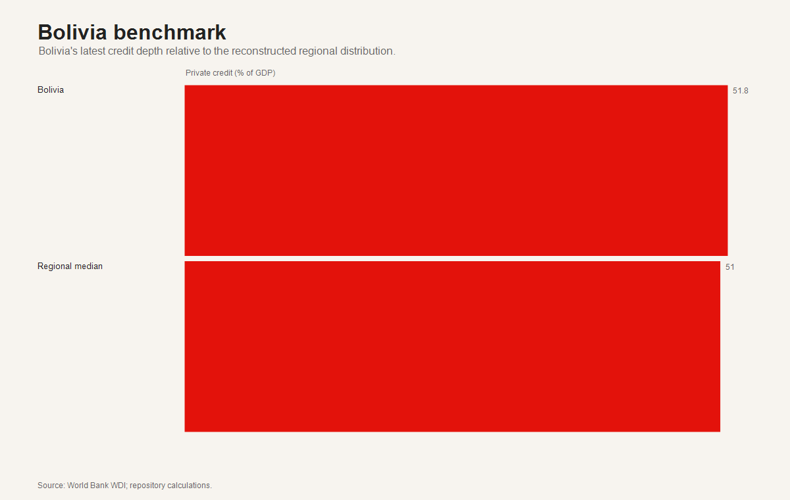

# Latin America Financial Development Lab

Repository: [latin-america-financial-development-lab](https://github.com/MonicaCT/latin-america-financial-development-lab)

This repository is a public-data research compendium on financial development in Latin America. It reconstructs the original project after the historical monthly regulator panels were found absent from Git history, then upgrades the analysis to a doctoral-portfolio standard: transparent measurement, distributional diagnostics, PCA, clustering, composite-index sensitivity, robust panel models, a policy dashboard and a working-paper report.

## Executive Summary

- **Research question:** how do financial depth, macroeconomic stability and productive structure differ across Latin America?
- **Data:** 1,122 country-year observations for 17 countries, reconstructed from official World Bank WDI indicators.
- **Integrity choice:** exact legacy product-credit and sector-credit panels are not fabricated; CreditType and EconomicSector are reconstructed as annual official equivalents.
- **Core finding:** the region separates into shallow, intermediate and deep financial-system profiles; rankings are informative but some are sensitive to index weights.
- **Bolivia:** visible in the regional benchmark, but stronger policy claims require renewed regulator-level sectoral credit reconstruction.

## Main Outputs

| Component | Link |
|---|---|
| Dashboard | [dashboard/index.html](dashboard/index.html) |
| Working paper | [report/financial_development_report.html](report/financial_development_report.html) |
| Executive report | [report/executive_report.html](report/executive_report.html) |
| Reconstructed panel | [data/processed/PanelCompleto.reconstructed.csv](data/processed/PanelCompleto.reconstructed.csv) |
| Advanced models | [outputs/models/advanced_model_results.csv](outputs/models/advanced_model_results.csv) |
| PCA scores | [outputs/tables/pca_scores.csv](outputs/tables/pca_scores.csv) |
| Clusters | [outputs/tables/cluster_assignments.csv](outputs/tables/cluster_assignments.csv) |

## Visual Preview

| Composite index | PCA clusters |
|---|---|
|  |  |

| Sensitivity | Bolivia |
|---|---|
|  |  |

## Methodology

The repository answers five research questions:

1. How unequal is financial depth across Latin America?
2. Are countries grouped into distinct financial-development profiles?
3. Do conclusions depend on arbitrary composite-index weights?
4. Are correlations robust to unobserved country and year heterogeneity?
5. Where does Bolivia sit in the regional distribution?

Methods include distributional analysis, outlier detection, correlation matrices, PCA, k-means clustering, composite indices, rank-sensitivity checks, pooled OLS, country fixed effects, two-way fixed effects, lagged models and robust uncertainty diagnostics.

## Reproducibility

Run the public-data reconstruction first:

`powershell
powershell.exe -NoProfile -ExecutionPolicy Bypass -File .\src\reconstruct_public_data.ps1 -Root (Resolve-Path .).Path
`

Then run the doctoral-quality upgrade:

`powershell
powershell.exe -NoProfile -ExecutionPolicy Bypass -File .\src\final_quality_upgrade.ps1 -Root (Resolve-Path .).Path
`

## Limitations

The project is scientifically honest about its boundary. The reconstructed annual WDI panel is internationally comparable and reproducible, but it is not the exact missing monthly regulator panel. The results should be read as macro-financial diagnostics and a strong portfolio artifact, not as final causal evidence about credit allocation.
