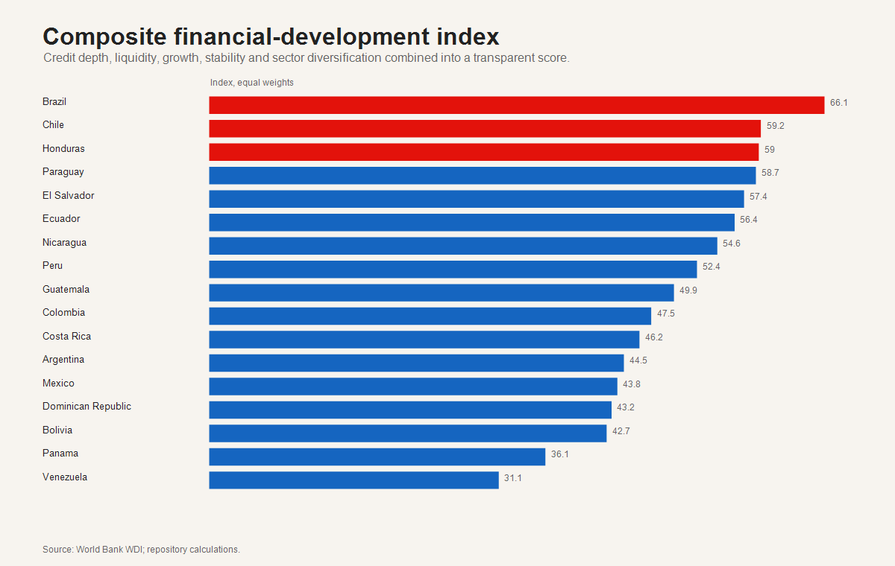
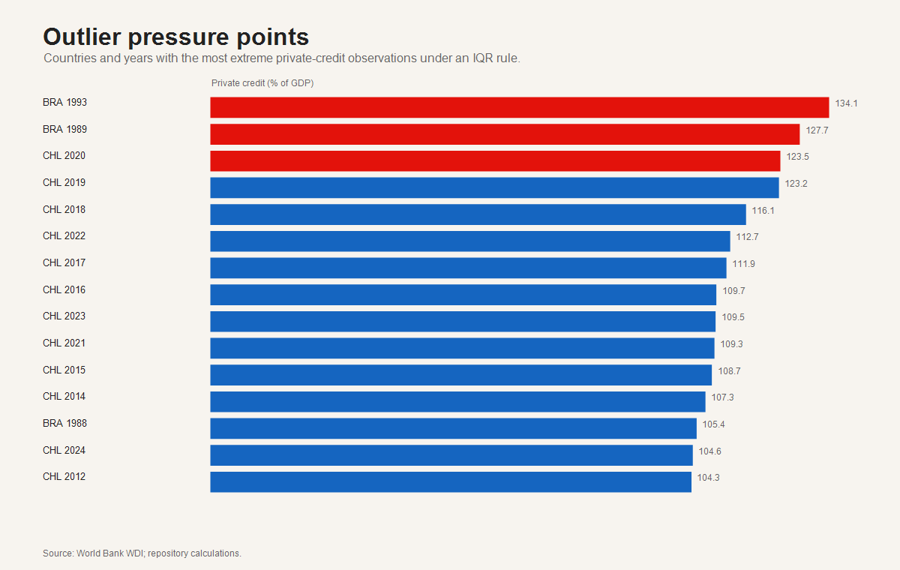
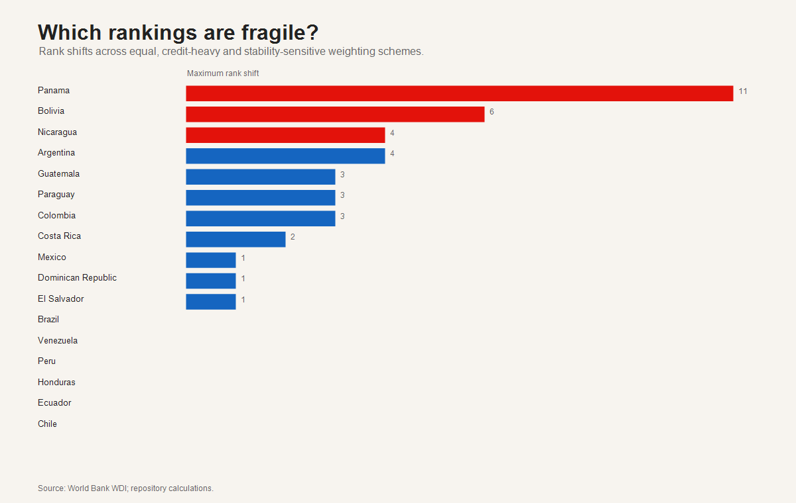

<!-- HTML-first working paper generated by src/final_quality_upgrade.ps1. -->
<!doctype html><html><head><meta charset="utf-8"><title>Latin America Financial Development Lab</title></head><body><main>
<h1>Latin America Financial Development Lab</h1>

A reconstructed public-data working paper for applied economics and policy analysis. Generated 2026-07-08. Repository: <a href="https://github.com/MonicaCT/latin-america-financial-development-lab">latin-america-financial-development-lab</a>.

<b>Abstract.</b> This paper reconstructs and extends a Latin American financial-development project after the original monthly regulator panels were found absent from the repository. Rather than fabricate missing credit-type and sector-credit series, the analysis builds a transparent annual country panel from World Bank WDI and evaluates financial depth, macroeconomic stability, productive-structure concentration and country heterogeneity. The evidence is descriptive and diagnostic, but the project now includes distributional analysis, outlier detection, PCA, clustering, composite-index sensitivity, fixed-effects models and a documented source-recovery audit.

<b>Countries</b> 17

<b>Country-year rows</b> 1122

<b>Top index country</b> Brazil

<b>Models</b> 5 specifications

<h2>1. Motivation and Literature</h2>

The core research question is whether financial depth in Latin America reflects a coherent development trajectory or a set of distinct national regimes shaped by macroeconomic volatility, scale, and productive structure. The motivation follows a long literature linking finance and growth, including King and Levine (1993), Levine (2005), Beck, Levine and Loayza (2000), and Rajan and Zingales (1998). The paper also treats financial expansion as potentially non-linear, consistent with the caution in Arcand, Berkes and Panizza (2015) and policy measurement work such as Svirydzenka (2016).

<h2>2. Data Reconstruction and Measurement</h2>

The exact legacy monthly panels cannot be restored from Git history because the raw backup workbooks and final processed files were not committed. The reconstructed dataset therefore uses official annual WDI indicators for private bank credit, financial-sector credit, broad money, GDP, GDP growth, inflation and sector value-added shares. This improves reproducibility and avoids invented disaggregation, but it changes the estimand: the project now measures macro-financial depth and economic structure, not exact product-level credit allocation.

<h2>3. Research Design</h2>
<table><thead><tr><th>research_question</th><th>evidence</th><th>output</th></tr></thead><tbody><tr><td>How unequal is financial depth across Latin America?</td><td>Distribution diagnostics, outlier table, country ranking</td><td>distribution_diagnostics.csv; outlier_observations.csv; country_ranking.csv</td></tr><tr><td>Are countries grouped into distinct financial-development profiles?</td><td>PCA and k-means clustering on latest indicators</td><td>pca_scores.csv; cluster_assignments.csv</td></tr><tr><td>Do conclusions depend on arbitrary composite-index weights?</td><td>Three weighting schemes and rank-shift sensitivity</td><td>sensitivity_analysis.csv</td></tr><tr><td>Are correlations robust to unobserved country and year heterogeneity?</td><td>OLS, country FE, two-way FE, lagged model, robust/DK-style SE</td><td>advanced_model_results.csv</td></tr><tr><td>Where does Bolivia sit in the regional distribution?</td><td>Bolivia benchmark against regional median and policy quadrant</td><td>bolivia_advanced_profile.csv</td></tr></tbody></table>
<h2>4. Stylized Facts</h2>

The latest country ranking places Brazil at the top of the composite index. Bolivia records 51.75% of GDP in latest private bank credit, 0.72 percentage points relative to the regional median. The distribution is uneven: the upper tail contains highly financialized systems, while several countries remain below the regional median even in recent years.

<figure><figcaption>Composite ranking, equal weights.</figcaption></figure>
<figure><figcaption>Outlier pressure points in private credit depth.</figcaption></figure>
<h2>5. Heterogeneity, PCA and Clustering</h2>

PCA and k-means clustering divide the region into shallow, intermediate and deep financial-system profiles. These clusters are not causal groups; they are descriptive typologies that help interpret heterogeneity in a compact way.

<figure><figcaption>PCA-based country profiles.</figcaption></figure>
<table><thead><tr><th>cluster_label</th><th>countries</th><th>country_list</th><th>mean_private_credit_gdp</th><th>mean_pc1</th></tr></thead><tbody><tr><td>Shallow financial systems</td><td>7</td><td>Argentina; Bolivia; Colombia; Nicaragua; Paraguay; Peru; Venezuela</td><td>37.76</td><td>-1.02</td></tr><tr><td>Deep financial systems</td><td>6</td><td>Brazil; Chile; Ecuador; El Salvador; Honduras; Panama</td><td>79.84</td><td>1.17</td></tr><tr><td>Intermediate financial systems</td><td>4</td><td>Costa Rica; Dominican Republic; Guatemala; Mexico</td><td>39.15</td><td>-0.03</td></tr></tbody></table>
<h2>6. Econometric Diagnostics</h2>

The econometric section preserves the original OLS logic but adds country fixed effects, two-way fixed effects, lagged specifications, country-cluster robust errors and a Driscoll-Kraay-style correction. These models are best interpreted as robustness diagnostics for conditional associations; they do not identify causal effects of finance on growth.

<table><thead><tr><th>model</th><th>term</th><th>estimate</th><th>std_error</th><th>t_stat</th><th>n</th><th>r_squared</th><th>se_type</th><th>note</th></tr></thead><tbody><tr><td>Pooled OLS</td><td>intercept</td><td>-72.3154</td><td>47.3906</td><td>-1.526</td><td>510</td><td>0.18</td><td>country-cluster robust</td><td>Annual WDI panel; descriptive association, not causal identification.</td></tr><tr><td>Pooled OLS</td><td>gdp_growth_annual_pct</td><td>-0.3517</td><td>0.1901</td><td>-1.85</td><td>510</td><td>0.18</td><td>country-cluster robust</td><td>Annual WDI panel; descriptive association, not causal identification.</td></tr><tr><td>Pooled OLS</td><td>inflation_annual_pct</td><td>0.0007</td><td>0.0025</td><td>0.276</td><td>510</td><td>0.18</td><td>country-cluster robust</td><td>Annual WDI panel; descriptive association, not causal identification.</td></tr><tr><td>Pooled OLS</td><td>log_gdp_current_usd</td><td>3.4295</td><td>2.2065</td><td>1.554</td><td>510</td><td>0.18</td><td>country-cluster robust</td><td>Annual WDI panel; descriptive association, not causal identification.</td></tr><tr><td>Pooled OLS</td><td>sector_value_added_hhi</td><td>71.3697</td><td>47.9456</td><td>1.489</td><td>510</td><td>0.18</td><td>country-cluster robust</td><td>Annual WDI panel; descriptive association, not causal identification.</td></tr><tr><td>Country fixed effects</td><td>gdp_growth_annual_pct</td><td>-0.2519</td><td>0.141</td><td>-1.787</td><td>510</td><td>0.352</td><td>country-cluster robust</td><td>Annual WDI panel; descriptive association, not causal identification.</td></tr><tr><td>Country fixed effects</td><td>inflation_annual_pct</td><td>0.0006</td><td>0.0026</td><td>0.247</td><td>510</td><td>0.352</td><td>country-cluster robust</td><td>Annual WDI panel; descriptive association, not causal identification.</td></tr><tr><td>Country fixed effects</td><td>log_gdp_current_usd</td><td>7.3304</td><td>1.3311</td><td>5.507</td><td>510</td><td>0.352</td><td>country-cluster robust</td><td>Annual WDI panel; descriptive association, not causal identification.</td></tr><tr><td>Country fixed effects</td><td>sector_value_added_hhi</td><td>32.7011</td><td>40.9241</td><td>0.799</td><td>510</td><td>0.352</td><td>country-cluster robust</td><td>Annual WDI panel; descriptive association, not causal identification.</td></tr><tr><td>Two-way fixed effects</td><td>gdp_growth_annual_pct</td><td>0.0052</td><td>0.2124</td><td>0.024</td><td>510</td><td>0.245</td><td>Driscoll-Kraay style</td><td>Annual WDI panel; descriptive association, not causal identification.</td></tr><tr><td>Two-way fixed effects</td><td>inflation_annual_pct</td><td>0.0006</td><td>0.0019</td><td>0.33</td><td>510</td><td>0.245</td><td>Driscoll-Kraay style</td><td>Annual WDI panel; descriptive association, not causal identification.</td></tr><tr><td>Two-way fixed effects</td><td>log_gdp_current_usd</td><td>6.4032</td><td>0.9353</td><td>6.846</td><td>510</td><td>0.245</td><td>Driscoll-Kraay style</td><td>Annual WDI panel; descriptive association, not causal identification.</td></tr><tr><td>Two-way fixed effects</td><td>sector_value_added_hhi</td><td>54.7608</td><td>39.4582</td><td>1.388</td><td>510</td><td>0.245</td><td>Driscoll-Kraay style</td><td>Annual WDI panel; descriptive association, not causal identification.</td></tr><tr><td>Lagged credit-depth model</td><td>intercept</td><td>0.0135</td><td>3.4255</td><td>0.004</td><td>527</td><td>0.925</td><td>country-cluster robust</td><td>Annual WDI panel; descriptive association, not causal identification.</td></tr><tr><td>Lagged credit-depth model</td><td>lag_private_credit_gdp</td><td>0.956</td><td>0.039</td><td>24.486</td><td>527</td><td>0.925</td><td>country-cluster robust</td><td>Annual WDI panel; descriptive association, not causal identification.</td></tr><tr><td>Lagged credit-depth model</td><td>gdp_growth_annual_pct</td><td>-0.1343</td><td>0.0614</td><td>-2.187</td><td>527</td><td>0.925</td><td>country-cluster robust</td><td>Annual WDI panel; descriptive association, not causal identification.</td></tr><tr><td>Lagged credit-depth model</td><td>inflation_annual_pct</td><td>-0.001</td><td>0.0011</td><td>-0.949</td><td>527</td><td>0.925</td><td>country-cluster robust</td><td>Annual WDI panel; descriptive association, not causal identification.</td></tr><tr><td>Lagged credit-depth model</td><td>log_gdp_current_usd</td><td>0.1146</td><td>0.1788</td><td>0.641</td><td>527</td><td>0.925</td><td>country-cluster robust</td><td>Annual WDI panel; descriptive association, not causal identification.</td></tr><tr><td>Two-way FE, post-2000</td><td>gdp_growth_annual_pct</td><td>-0.4583</td><td>0.1199</td><td>-3.823</td><td>361</td><td>0.103</td><td>Driscoll-Kraay style</td><td>Annual WDI panel; descriptive association, not causal identification.</td></tr><tr><td>Two-way FE, post-2000</td><td>inflation_annual_pct</td><td>-0.0183</td><td>0.0547</td><td>-0.335</td><td>361</td><td>0.103</td><td>Driscoll-Kraay style</td><td>Annual WDI panel; descriptive association, not causal identification.</td></tr><tr><td>Two-way FE, post-2000</td><td>log_gdp_current_usd</td><td>-0.24</td><td>1.6949</td><td>-0.142</td><td>361</td><td>0.103</td><td>Driscoll-Kraay style</td><td>Annual WDI panel; descriptive association, not causal identification.</td></tr><tr><td>Two-way FE, post-2000</td><td>sector_value_added_hhi</td><td>77.8732</td><td>13.331</td><td>5.842</td><td>361</td><td>0.103</td><td>Driscoll-Kraay style</td><td>Annual WDI panel; descriptive association, not causal identification.</td></tr></tbody></table>
<table><thead><tr><th>diagnostic</th><th>statistic</th><th>df</th><th>decision</th><th>rationale</th></tr></thead><tbody><tr><td>Hausman-style FE vs RE decision</td><td>not reported as formal chi-square</td><td>4</td><td>Prefer fixed-effects interpretation</td><td>Country heterogeneity is substantively central and the WDI panel is not a randomized sample; FE/TWFE estimates are more defensible for within-country associations.</td></tr></tbody></table>
<h2>7. Sensitivity</h2>

Composite rankings can be sensitive to normative weights. The sensitivity table compares equal, credit-heavy and stability-sensitive weights. A stable ranking across these schemes is more credible as a portfolio insight than one driven by a single index specification.

<figure><figcaption>Rank fragility across weighting schemes.</figcaption></figure>
<h2>8. Policy Interpretation</h2>

Three implications follow. First, countries with deep credit systems should be evaluated jointly on depth and stability, not depth alone. Second, shallow-credit countries require institutional and information-infrastructure reforms before credit expansion can be interpreted as productive transformation. Third, Bolivia's position suggests the need to distinguish credit volume from allocation quality; the reconstructed WDI panel cannot answer sectoral allocation questions without renewed regulator-level harmonization.

<h2>9. Limitations</h2>

The largest limitation is measurement. Annual WDI indicators are internationally comparable but less granular than the missing legacy country-regulator panels. Fixed effects reduce time-invariant country confounding, but unobserved time-varying reforms, crises, exchange-rate regimes and regulatory shifts remain outside the model. The results are therefore suitable for a doctoral portfolio and as a basis for future data work, not as final causal evidence.

<h2>10. Conclusion</h2>

The project now behaves like a research compendium: it reconstructs data transparently, asks interpretable questions, runs multiple empirical diagnostics, visualizes uncertainty and documents limitations. The next scientific frontier is to rebuild monthly regulator-level sectoral credit panels for the countries where official APIs or current statistical portals can support a harmonized update.

<h2>References</h2>
<ol class="refs">
<li>Arcand, J.-L., Berkes, E. and Panizza, U. (2015). Too much finance? Journal of Economic Growth.</li>
<li>Beck, T., Levine, R. and Loayza, N. (2000). Finance and the sources of growth. Journal of Financial Economics.</li>
<li>King, R. G. and Levine, R. (1993). Finance and growth: Schumpeter might be right. Quarterly Journal of Economics.</li>
<li>Levine, R. (2005). Finance and growth: theory and evidence. Handbook of Economic Growth.</li>
<li>Rajan, R. G. and Zingales, L. (1998). Financial dependence and growth. American Economic Review.</li>
<li>Svirydzenka, K. (2016). Introducing a new broad-based index of financial development. IMF Working Paper.</li>
</ol>
</main></body></html>
